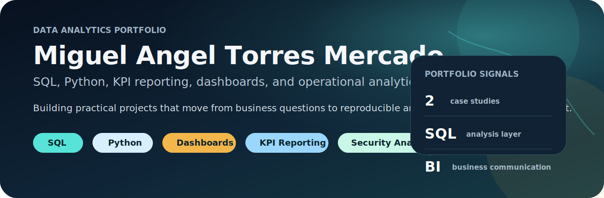
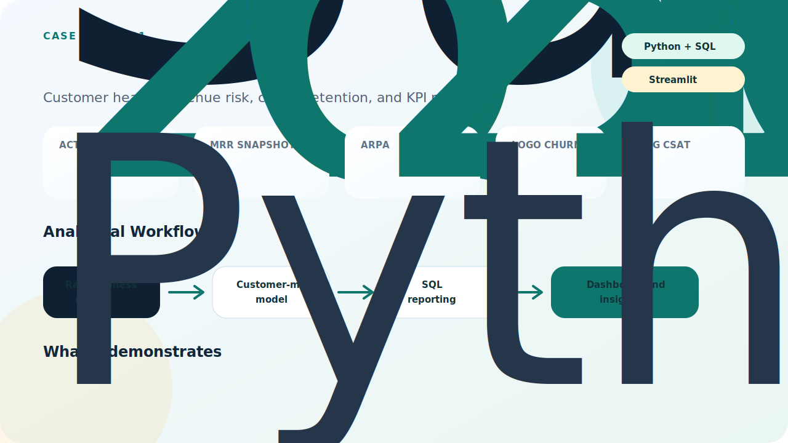
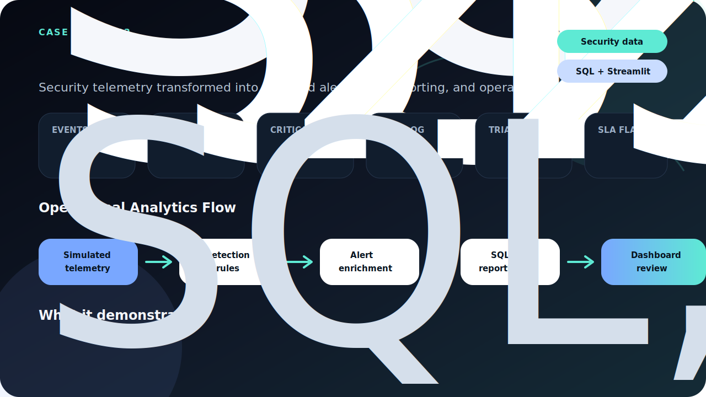

# Miguel Angel Torres Mercado

Entry-Level Data Analyst focused on SQL, Python, KPI reporting, dashboards, and business-focused analytics.

I am a Systems Engineering student from Cartagena, Colombia, building a portfolio around practical data workflows: querying, cleaning, modeling, reporting, and explaining results clearly. My background in cybersecurity gives me an additional operational mindset for analyzing risk, alerts, and monitoring data.

## Fast Review

- Recruiter brief: [RECRUITER_BRIEF.md](RECRUITER_BRIEF.md)
- SQL evidence: [SQL_EVIDENCE.md](SQL_EVIDENCE.md)
- Case studies: [CASE_STUDIES.md](CASE_STUDIES.md)
- Project overview: [PROJECTS.md](PROJECTS.md)

## Current Focus

- SQL for analysis, joins, aggregation, filtering, and business questions
- Python for data processing, reproducible workflows, and analytical outputs
- KPI reporting and dashboard communication
- Customer behavior, retention, churn risk, and operational analytics
- Security analytics, SOC metrics, detection logic, and Wazuh-based lab work

## Featured Case Studies

### Subscription Analytics Lab

End-to-end analytics project for a simulated subscription business.

- Repository: https://github.com/Abionit/subscription-analytics-lab
- Stack: Python, SQL, SQLite, Streamlit
- Focus: revenue analytics, KPI reporting, cohort retention, churn risk, and customer health monitoring
- Demonstrates: analytical modeling, reusable SQL, reporting outputs, dashboarding, and business communication

### Wazuh SOC Detection Engineering Lab

Flagship security analytics project built around Wazuh SIEM/XDR, custom detections, MITRE ATT&CK mapping, triage workflow, and alert reporting.

- Repository: https://github.com/Abionit/soc-home-lab/tree/portfolio/wazuh-soc-detection-lab
- Stack: Wazuh, Docker, Python, SQLite, Streamlit
- Focus: SOC detection engineering, custom rules, alert triage, MITRE mapping, and security analytics reporting
- Demonstrates: SIEM workflow, detection logic, operational metrics, reporting, and technical documentation

### SOC Home Lab v2

Security analytics project that simulates a small SOC detection and reporting workflow.

- Repository: https://github.com/Abionit/soc-home-lab/tree/portfolio/soc-home-lab-v2
- Stack: Python, SQL, SQLite, Streamlit
- Focus: simulated telemetry, detection rules, alert enrichment, triage metrics, and SQL reporting
- Demonstrates: operational analysis, security context, metric design, and dashboard presentation

## Technical Skills

- Data: SQL, Python, pandas, SQLite
- Reporting: KPI design, CSV/Markdown reporting, Streamlit dashboards
- Workflow: GitHub, reproducible scripts, documentation, testing basics
- Security context: SOC concepts, Wazuh, detection logic, alert triage, operational metrics

## Learning Path

- DataCamp SQL track, including Intermediate SQL
- Data Analyst foundations with SQL and Python
- Ongoing practice through portfolio projects and technical documentation

## Contact

- LinkedIn: https://linkedin.com/in/miguel-angel-torres-mercado-3b7bb8290
- Email: miguelangeltorresmercado58@gmail.com
- GitHub: https://github.com/Abionit
