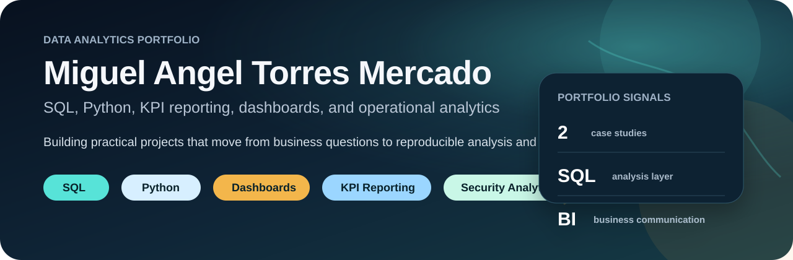
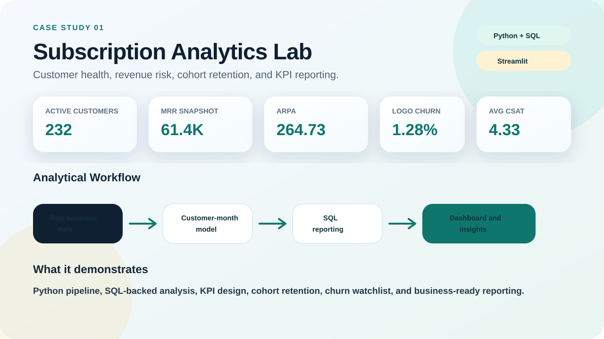
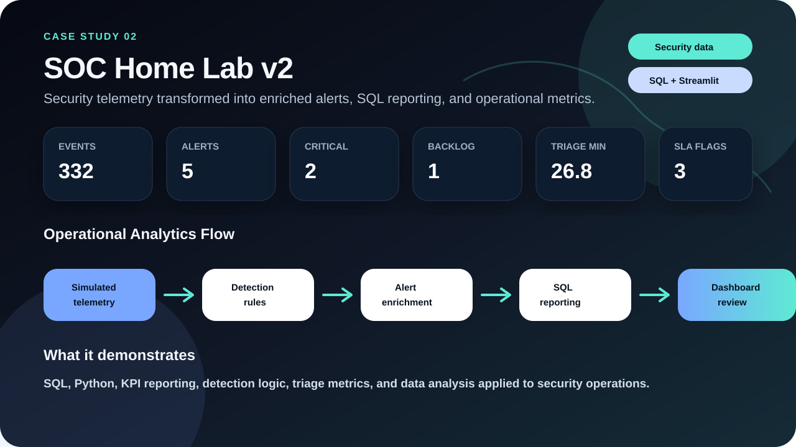

# Miguel Angel Torres Mercado

Systems Engineer focused on Data Engineering, cloud data pipelines, data quality, and Security Operations analytics.

Based in Cartagena, Colombia. My work combines Python, SQL, AWS-oriented data architecture, ETL workflows, analytical modeling, and security monitoring. The projects in this portfolio are structured around practical company problems, reproducible execution, technical documentation, and reviewable evidence.

## Key Links

- Portfolio site: https://abionit.github.io/AbionitOne/
- Recruiter brief: [RECRUITER_BRIEF.md](RECRUITER_BRIEF.md)
- Data engineering project: [Subscription Analytics Lab](https://github.com/Abionit/subscription-analytics-lab)
- AWS architecture: https://github.com/Abionit/subscription-analytics-lab/blob/main/docs/aws_architecture.md
- Data quality evidence: https://github.com/Abionit/subscription-analytics-lab/blob/main/output/data_quality_report.md
- SOC detection project: https://github.com/Abionit/soc-home-lab/tree/portfolio/wazuh-soc-detection-lab
- SQL evidence: [SQL_EVIDENCE.md](SQL_EVIDENCE.md)

## Professional Focus

- Data Engineer
- Analytics Engineer
- Cloud Data Engineering
- Security Analytics
- SOC Operations and Detection Engineering

## Featured Work

### AWS Subscription Data Pipeline

Data engineering and analytics solution for a simulated subscription business.

**Company problem**

Customer, subscription, billing, product usage, and support information arrives from separate sources. Reporting and operations teams need trusted datasets for revenue, retention, customer health, and churn-risk analysis.

**Solution**

- Integrates five source datasets into a customer-month analytical model.
- Applies automated schema, key, completeness, foreign-key, and business-range checks.
- Stops processing when critical quality rules fail.
- Produces KPI, cohort, churn-risk, segment, and revenue-anomaly datasets.
- Materializes a local SQLite analytical layer with reusable SQL.
- Defines an AWS pipeline with S3 raw and curated zones, Glue/PySpark, Glue Data Catalog, Athena, and CloudFormation.
- Includes an optional Redshift warehouse schema and Parquet load path.

**Verified evidence**

- Local pipeline processed `240` customers, `2,351` billing events, `67,706` usage records, and `3,299` support tickets.
- `24/24` data quality checks passed.
- `5/5` automated tests passed.
- CloudFormation passed `cfn-lint` validation.
- AWS source code and infrastructure are published. Cloud execution evidence will be added after deployment in an AWS account.

**Review path**

- Repository: https://github.com/Abionit/subscription-analytics-lab
- Architecture: https://github.com/Abionit/subscription-analytics-lab/blob/main/docs/aws_architecture.md
- Glue/PySpark job: https://github.com/Abionit/subscription-analytics-lab/blob/main/aws/glue/subscription_etl.py
- Athena queries: https://github.com/Abionit/subscription-analytics-lab/blob/main/aws/athena/portfolio_queries.sql
- CloudFormation: https://github.com/Abionit/subscription-analytics-lab/blob/main/infrastructure/cloudformation.yaml
- Quality report: https://github.com/Abionit/subscription-analytics-lab/blob/main/output/data_quality_report.md

### Wazuh SOC Detection Engineering Lab

Security operations project built around Wazuh SIEM/XDR, custom detections, MITRE ATT&CK mapping, alert triage, and security reporting.

**Company problem**

A SOC needs clear detection coverage, alert prioritization, triage context, and operational reporting instead of isolated raw events.

**Solution and evidence**

- Custom Wazuh detection rules for authentication, PowerShell, account, file, malware, web, privilege, and credential scenarios.
- MITRE ATT&CK mapping and detection catalog.
- Alert enrichment, triage queue, SOC metrics, and executive reporting.
- Python, SQLite, and Streamlit reporting layer.

Repository: https://github.com/Abionit/soc-home-lab/tree/portfolio/wazuh-soc-detection-lab

### SOC Home Lab v2

Operational analytics project that converts simulated telemetry into enriched alerts, SQL reports, KPI outputs, and dashboard views.

- Tracks workload, severity, backlog, ownership, triage time, and SLA-style indicators.
- Provides reusable SQL for alert trends, rule performance, and active backlog.
- Connects data analysis practices with SOC monitoring and operational prioritization.

Repository: https://github.com/Abionit/soc-home-lab/tree/portfolio/soc-home-lab-v2

## Technology Evidence

| Area | Tools and evidence |
| --- | --- |
| Data pipelines | Python orchestration, pandas transformations, five-source integration, repeatable ETL workflow |
| Data quality | Schema, key, null, foreign-key, category, revenue, usage, and support validation |
| SQL and modeling | SQLite analytical layer, customer-month model, KPI views, Athena queries, Redshift schema |
| AWS | S3 architecture, Glue/PySpark job, Data Catalog crawler, Athena workgroup, CloudFormation |
| Security operations | Wazuh, custom detections, MITRE ATT&CK, triage, SOC metrics, alert reporting |
| Engineering workflow | GitHub, automated tests, CI workflow, technical documentation, reproducible scripts |

## Technical Stack

- Programming and data: Python, pandas, SQL, SQLite
- Data engineering: ETL/ELT concepts, data integration, data validation, quality gates, analytical modeling, Parquet partitioning
- AWS project stack: S3, Glue, PySpark, Glue Data Catalog, Athena, CloudFormation
- Warehouse integration: Redshift schema and S3 Parquet load path
- Security operations: Wazuh, SIEM/XDR concepts, MITRE ATT&CK, alert triage, detection reporting
- Reporting: Streamlit, CSV, Markdown, KPI and operational reporting
- Workflow: Git, GitHub, automated tests, CI, documentation

## Current Development

- Deployment and monitoring of the AWS pipeline
- PySpark processing and partition optimization
- Redshift warehouse operations
- Cloud security and observability for data workflows

## Contact

- Portfolio: https://abionit.github.io/AbionitOne/
- LinkedIn: https://linkedin.com/in/miguel-angel-torres-mercado-3b7bb8290
- Email: miguelangeltorresmercado58@gmail.com
- GitHub: https://github.com/Abionit
